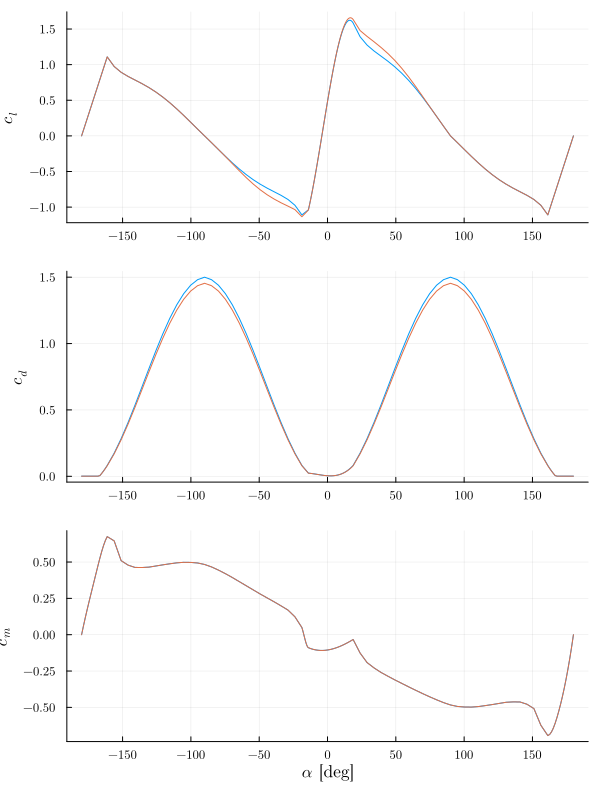

# AirfoilPolars

- Polar calculation
- Polar extrapolation
- Mach (Glauert) and rotation correction (Du and Selig)
- Inspired by [1]

</img>

## References

1. https://github.com/WISDEM/AirfoilPreppy