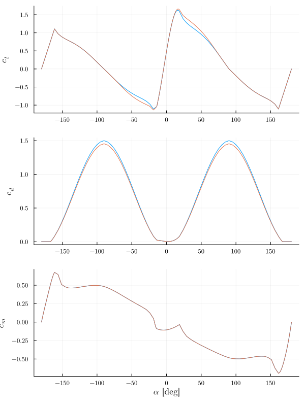
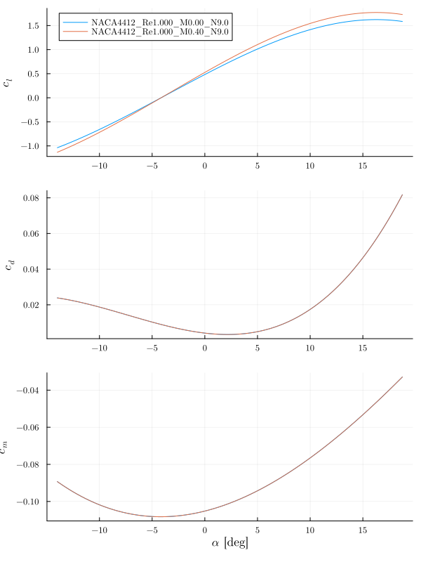

# AirfoilPolars

- Polar calculation
- Polar extrapolation
- Mach (Glauert) and rotation correction (Du and Selig)
- Inspired by AirfoilPreppy [1]

## Corrections

### Rotation

### Mach

## References

1. <https://github.com/WISDEM/AirfoilPreppy>
